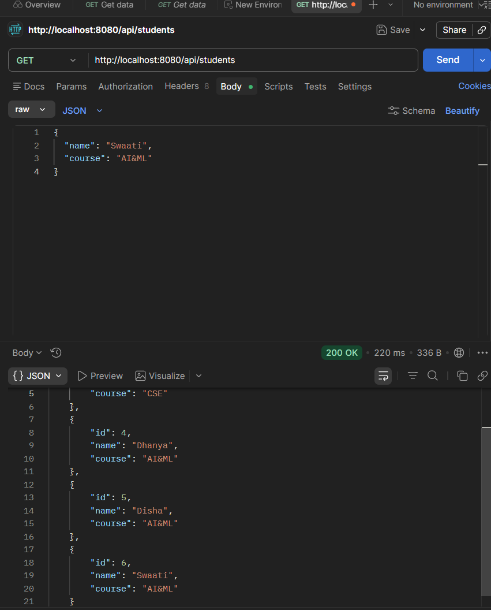
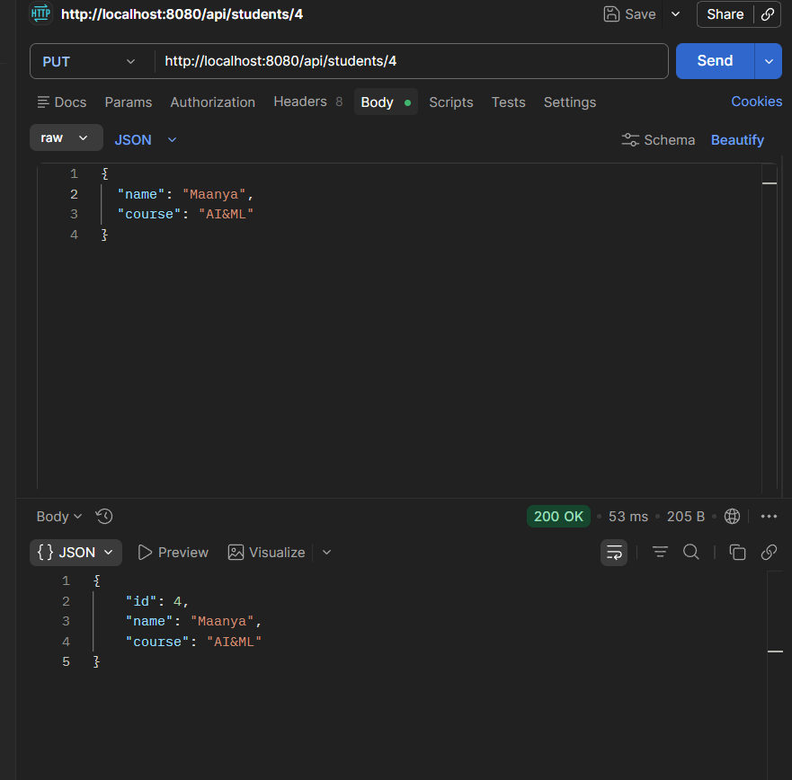
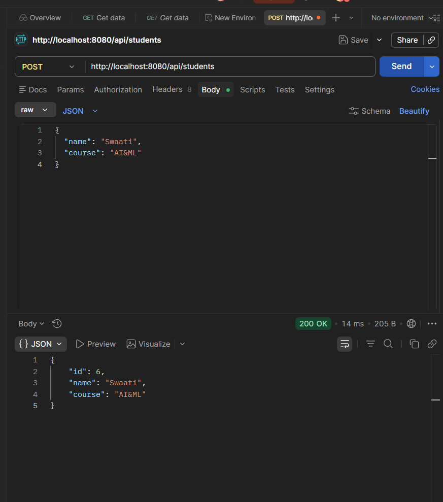
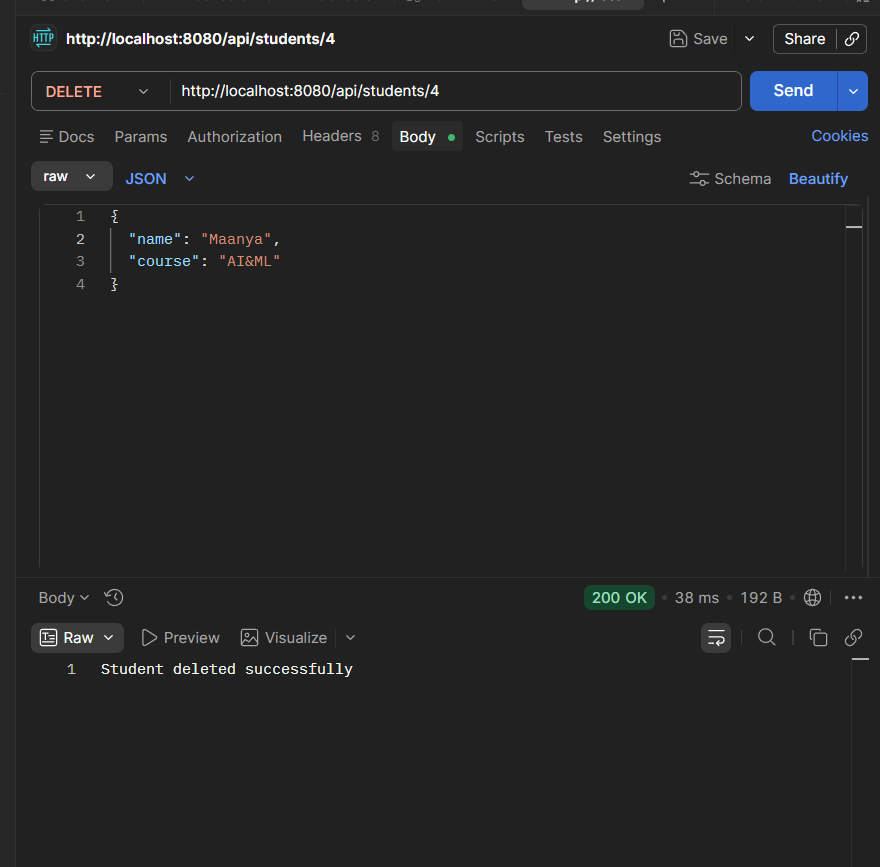
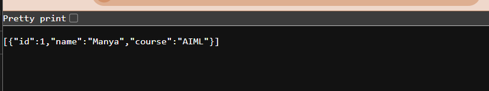

# 🎓 STUDENT MANAGEMENT REST API  
### 🚀 Built with Spring Boot & MySQL  

<p align="center">
  <b>A RESTful API for managing student data using a clean layered architecture</b>
</p>

---

## 📌 Overview  

This project is a **Spring Boot-based REST API** designed to perform operations on student data.  
It follows a **layered architecture (Controller → Service → Repository → Model)** ensuring scalability and maintainability.  

---

## 🛠️ Tech Stack  

- 💻 **Spring Boot**  
- ☕ **Java (JDK 21)**  
- 🗄️ **MySQL Database**  
- 🔧 **Maven**  
- 🧪 **Postman (API Testing)**  

---

## ⚙️ Features  

✔ Add new student  
✔ Retrieve all students  
✔ Retrieve student by ID  
✔ Clean architecture  
✔ Database integration using JPA  

---

## 🔗 API Endpoints  

### 📍 Base URL  
http://localhost:8080/api/students


---

| Method | Endpoint | Description |
|--------|--------|------------|
| GET | `/api/students` | Get all students |
| GET | `/api/students/{id}` | Get student by ID |
| POST | `/api/students` | Add new student |
| DELETE | `/api/students/{id}` | Delete student by ID|
| PUT | `/api/students{id}` | Update student by ID |


---

## 🧪 Example Request  

```json
{
  "name": "Manya",
  "course": "AIML"
}
```
## 📸 Screenshots  

### 🔹 GET OUTPUT  



---

### 🔹 PUT OUTPUT 



---

### 🔹 POST OUTPUT 



---

### 🔹 DELETE OUTPUT 



---

### 🔹 Localhost Output  




## ⚙️ How to Run

```bash
git clone https://github.com/your-username/rest-api.git
cd rest-api
mvn spring-boot:run
```

## 🧠 Architecture  

- **Controller Layer** → Handles HTTP requests and responses  
- **Service Layer** → Contains business logic  
- **Repository Layer** → Performs database operations  
- **Model Layer** → Represents the entity structure
- 
⭐ Support

If you like this project, give it a ⭐ on GitHub!

## 👩‍💻 Author  

**Manya Sondhi**
